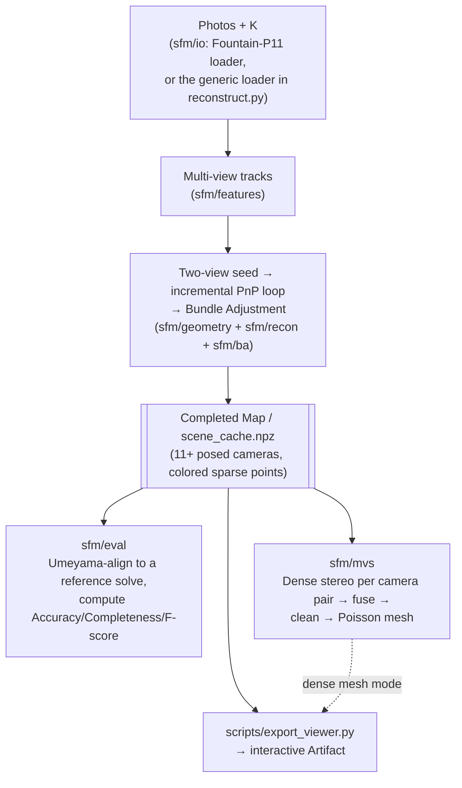

# Architecture

Two views of the same system: **how the code is layered** (which package depends on which) and **how data actually flows** through the pipeline's independent stages.

## Module dependency graph

```mermaid
flowchart TB
    subgraph IO["sfm/io — loading, calibration, export"]
        FOUNTAIN["fountain.py<br/>Fountain-P11 loader + shared K"]
        GENERIC["generic.py<br/>any photo folder + K"]
        CALIB["calibration.py<br/>EXIF-based K estimate"]
        CAMFILE["camera_file.py<br/>Strecha .camera sidecar parser"]
        REFERENCE["reference.py<br/>solution.graph parser (eval reference)"]
        COLORIZE["colorize.py<br/>sample point colors from source photos"]
        PLY["ply.py<br/>PLY export (XYZ / XYZRGB)"]
    end

    subgraph FEAT["sfm/features — 2D correspondences"]
        MATCH["matching.py<br/>sift_match (one pair)"]
        TRACKS["tracks.py<br/>build_tracks (all pairs → union-find)"]
    end

    subgraph GEOM["sfm/geometry — hand-written math"]
        FUND["fundamental.py<br/>Hartley norm + 8-point + RANSAC"]
        ESS["essential.py<br/>E decompose + cheirality"]
        TRI["triangulation.py<br/>DLT triangulation"]
        PNP["pnp.py<br/>calibrated DLT PnP + RANSAC"]
    end

    subgraph BA["sfm/ba — optimization"]
        SBA["scipy_ba.py<br/>bundle_adjust (scipy, sparse Jacobian)"]
        SO3["so3.py<br/>Rodrigues exponential map"]
        JAC["jacobian.py<br/>analytic reprojection Jacobian"]
        LM["lm.py<br/>hand_bundle_adjust (Schur-complement LM)"]
    end

    subgraph RECON["sfm/recon — orchestration"]
        TWOVIEW["two_view.py<br/>reconstruct_two_view"]
        INCR["incremental.py<br/>run_incremental_sfm"]
    end

    subgraph EVAL["sfm/eval — standalone, post-hoc"]
        UMEYAMA["umeyama.py<br/>closed-form similarity alignment"]
        METRICS["metrics.py<br/>Accuracy / Completeness / F-score"]
    end

    subgraph MVS["sfm/mvs — standalone, post-hoc"]
        STEREO["stereo.py<br/>rectify + StereoSGBM + WLS"]
        FUSE["fuse.py<br/>multi-pair dense reconstruct"]
        MESH["mesh.py<br/>clean + cluster + Poisson mesh"]
        PARAMS["params.py<br/>depth window + voxel size"]
    end

    subgraph CORE["sfm/map.py — shared data model"]
        MAP["Camera · Point3D · Observation · Map"]
    end

    GENERIC --> CALIB
    GENERIC --> CAMFILE

    TRACKS --> FUND
    TWOVIEW --> MATCH
    TWOVIEW --> FUND
    TWOVIEW --> ESS
    ESS --> TRI

    INCR --> TRACKS
    INCR --> FUND
    INCR --> ESS
    INCR --> TRI
    INCR --> PNP
    INCR -. default BA, overridable .-> SBA

    JAC --> SO3
    LM --> JAC
    LM --> SO3

    FOUNTAIN --> MAP
    COLORIZE --> MAP
    TWOVIEW --> MAP
    INCR --> MAP
    SBA --> MAP
    JAC --> MAP
    LM --> MAP
    MAP --> PLY

    style MAP fill:#2b2b40,stroke:#8888ff,stroke-width:2px,color:#fff
```



**Layering rules:**
- `sfm/geometry` and `sfm/features` never import `sfm/recon` or `sfm/ba` — dependencies only point "up" toward orchestration.
- `sfm/map.py` is the one thing almost everything touches, since it's the shared state every stage reads from and writes into.
- `sfm/recon/incremental.py` only *hard*-imports `sfm.ba.scipy_ba` as its default optimizer — the hand-written LM solver (`sfm.ba.lm.hand_bundle_adjust`) is passed in from the caller via a `bundle_adjust_fn` parameter, not imported by `sfm/recon` itself. Scripts choose which one to use.
- `sfm/eval` and `sfm/mvs` are **fully standalone** — zero `sfm.*` imports, pure numpy/scipy/OpenCV/Open3D. They don't operate on a `Map` object; they take plain arrays (points, camera poses, images) that a script pulls out of a finished reconstruction. This is what makes them reusable post-processing steps rather than something wired into the core pipeline.
- `sfm/mvs/params.py` exists because both MVS callers used to derive the depth window and
  voxel size independently, from the sparse cloud's world-Z percentiles — wrong in two
  separate ways (see its module docstring, and PLAN.md's "Dense-stage parameter derivation").
- **The true top of the dependency graph is `scripts/`, not `sfm/recon`.** It's scripts that decide which BA to use, and whether to also run `sfm/eval` and/or `sfm/mvs` on the result.

## Pipeline data flow

One core reconstruction pipeline produces a scene (cameras + sparse points); three independent stages can each consume it afterward.



## Plain-text fallback

If Mermaid doesn't render in your viewer:

```
Photos + K (Fountain-P11 loader, or reconstruct.py's generic any-folder loader)
        |
        v
sfm/features/tracks.py :: build_tracks()
  - SIFT + FLANN per image, all pairs matched
  - RANSAC-verified pairwise matches
  - union-find chains matches into multi-view tracks
        |
        v
sfm/recon/incremental.py :: run_incremental_sfm()
  - seed_two_view(): F -> E -> R,t -> DLT triangulation (sfm/geometry)
  - loop: RANSAC PnP registers the next camera (next-best-view),
    triangulate newly-visible tracks, re-run Bundle Adjustment
    (default: sfm/ba/scipy_ba.py; scripts can pass sfm/ba/lm.py's
    hand-written Schur-complement LM instead via bundle_adjust_fn)
        |
        v
filter_outlier_observations() + a final BA pass
        |
        v
scene_cache.npz  (cameras + colored sparse points -- the shared
                   hand-off point for everything below)
        |
        +--> sfm/eval:  Umeyama-align to a reference solve (sfm/io/reference.py),
        |               compute Accuracy/Completeness/F-score
        |
        +--> sfm/mvs:   dense stereo per camera pair (sfm/mvs/stereo.py) -> fuse
        |               (sfm/mvs/fuse.py) -> clean + Poisson mesh (sfm/mvs/mesh.py)
        |
        +--> scripts/export_viewer.py: build an interactive Artifact
                        (sparse points always; + the dense mesh if one exists)
```

## Module responsibilities

| Package | Responsibility | Depends on |
|---|---|---|
| `sfm/map.py` | Shared scene state: cameras, 3D points, 2D-3D observations | nothing (pure data model) |
| `sfm/io/` | Dataset loading (Fountain-P11 *and* generic photo folders), camera calibration (EXIF guess, or a real `.camera` sidecar file when a dataset ships one), reference-solve parsing for evaluation, point coloring, PLY export | `sfm/map.py` (only `fountain.py` and `colorize.py`) — the rest (`calibration.py`, `camera_file.py`, `generic.py`, `reference.py`) are standalone |
| `sfm/features/` | Turn pixels into correspondences: single-pair matching, and multi-view tracks across all images | OpenCV (SIFT/FLANN) + `sfm/geometry/fundamental.py` (for RANSAC-verifying track edges) |
| `sfm/geometry/` | All the hand-written math: F/E estimation, pose decomposition, DLT triangulation, DLT PnP | numpy only — no OpenCV, no `sfm/recon` |
| `sfm/ba/` | Bundle Adjustment — jointly refines every camera + point. Two interchangeable optimizers: scipy-backed (`scipy_ba.py`) and hand-written Schur-complement LM (`so3.py` + `jacobian.py` + `lm.py`) | `sfm/map.py` |
| `sfm/recon/` | Orchestration — calls features/geometry/ba in the right order, owns the incremental registration loop | `sfm/features`, `sfm/geometry`, `sfm/map`, `sfm/ba/scipy_ba` (default only) |
| `sfm/eval/` | Umeyama alignment + Accuracy/Completeness/F-score against a reference reconstruction | nothing (standalone: numpy + scipy) |
| `sfm/mvs/` | Dense stereo, multi-pair fusion, Poisson surface reconstruction, and the derivation of the dense stage's own parameters (`params.py`: depth window from per-camera depths, voxel size from the sensor's resolution limit) | nothing (standalone: numpy + OpenCV contrib + Open3D) |
| `scripts/` | Two kinds: dataset-specific `verify_*.py` checks (one per project stage, Fountain-P11 only, plus `verify_cheirality.py` which is synthetic and needs no dataset), and the general-purpose tools — `reconstruct.py` (any photo folder → sparse/dense reconstruction), `export_viewer.py` (any finished reconstruction → interactive Artifact), `build_scene_cache.py` | `sfm/*` — this is the layer that actually wires `sfm/ba/lm`, `sfm/eval`, and `sfm/mvs` into a run |

See [PLAN.md](PLAN.md) for which stages are done vs. upcoming, and the comments inside each file (added for exactly this kind of orientation) for the *why* behind each algorithm.
